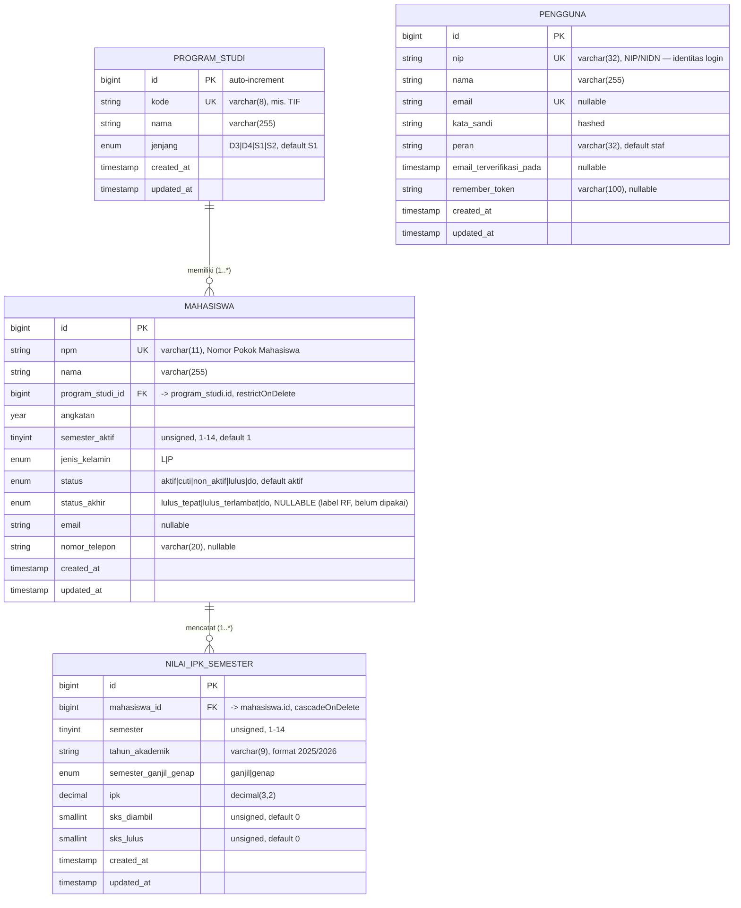
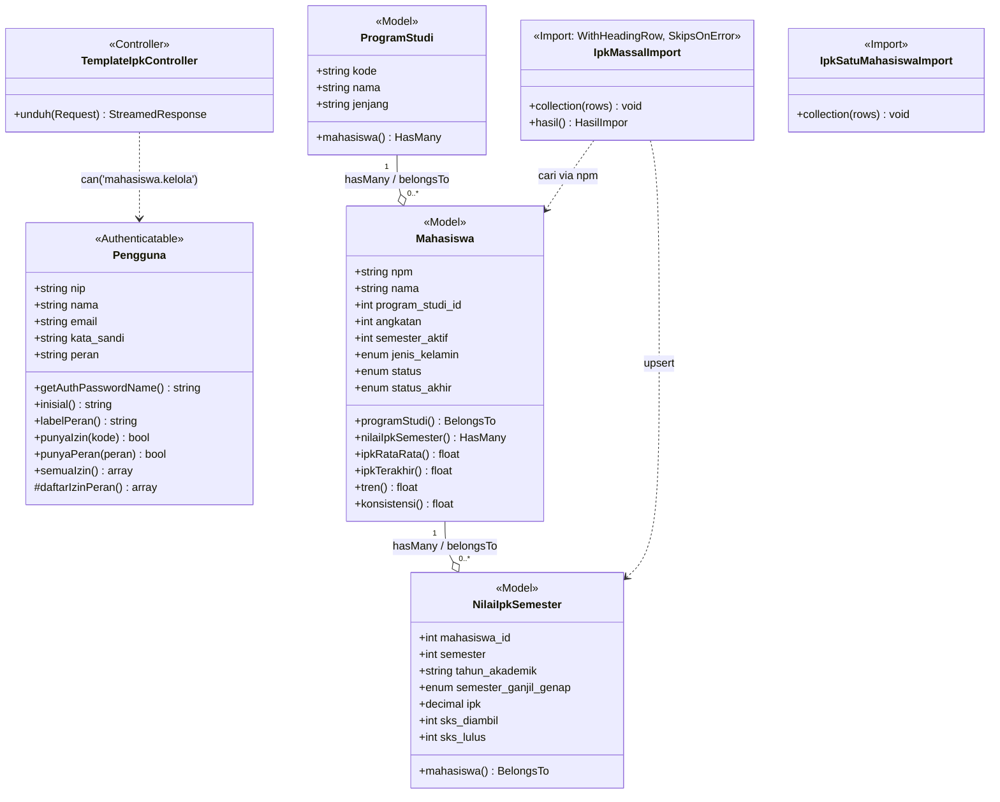

# Analisis Codebase SIMAFTUNSUR

> Diturunkan dari codebase nyata: `app/Models/`, `app/Http/`, `routes/web.php`, `config/peran.php`, migrations, Fortify.
> Terakhir diperbarui: 2026-06-24. Render Mermaid di <https://mermaid.live> atau VS Code (ekstensi *Markdown Preview Mermaid Support*).

---

## 1. ERD — `erDiagram` (hanya tabel domain bisnis)

Tabel bawaan Laravel (`migrations`, `sessions`, `cache`, `cache_locks`, `jobs`, `job_batches`, `failed_jobs`, `password_reset_tokens`) **diabaikan**. Tersisa 4 tabel bisnis.

**Kardinalitas & constraint:**
- `program_studi (1) —— (0..*) mahasiswa` — FK `restrictOnDelete` (prodi tak bisa dihapus selama masih punya mahasiswa), `cascadeOnUpdate`.
- `mahasiswa (1) —— (0..*) nilai_ipk_semester` — FK `cascadeOnDelete` + `cascadeOnUpdate`.
- Unik gabungan: `nilai_ipk_semester (mahasiswa_id, semester)` — 1 catatan per semester per mahasiswa.
- Index: `mahasiswa (program_studi_id, angkatan)` & `mahasiswa (status)`; `nilai_ipk_semester (tahun_akademik)`.
- `pengguna` **berdiri sendiri** — RBAC tidak pakai tabel (`roles`/`permissions`), melainkan peta statis di `config/peran.php`. Tidak ada relasi FK dari `pengguna`.

---

## 2. Class Diagram — `classDiagram` (Models + Controller)

**Method penting "controller" (CRUD mahasiswa ditangani komponen Volt, bukan Controller klasik):**

| Page-controller (Volt) | Method/aksi penting | Guard |
|---|---|---|
| `mahasiswa/index` | `daftarProdi()`, `daftarAngkatan()`, filter `kataKunci/filterProdi/filterAngkatan/filterStatus`, `bersihkanFilter()`, pagination | auth (lihat); tombol kelola `@can('mahasiswa.kelola')` |
| `mahasiswa/baru` | `simpan()` (validasi + create) | `abort_unless can('mahasiswa.kelola')` di `mount()` |
| `mahasiswa/ubah` | `simpan()` (update) | `abort_unless can('mahasiswa.kelola')` |
| `mahasiswa/detail` | tambah/ubah/hapus IPK, lihat tren | `abort_unless can('mahasiswa.kelola')` per aksi |
| `mahasiswa/impor` | proses upload Excel → `IpkMassalImport` | `abort_unless can('mahasiswa.kelola')` |
| `TemplateIpkController@unduh` | generate CSV template (mode massal/satu) | `abort_unless can('mahasiswa.kelola')` |

---

## 3. Aktor, Hak Akses & Use Case

### 3a. Aktor & peta izin (`config/peran.php`)

| Aktor (peran) | Izin terdefinisi |
|---|---|
| **Administrator** (`admin`) | `*` — seluruh izin (wildcard, di-resolve `Pengguna::punyaIzin()`) |
| **Wakil Dekan III** (`wd3`) | `mahasiswa.kelola`, `klasterisasi.lihat`, `klasterisasi.jalankan`, `laporan.lihat`, `laporan.ekspor` |
| **Staf Kemahasiswaan** (`staf`) | `mahasiswa.kelola`, `ipk.kelola` |
| **Ketua Program Studi** (`kaprodi`) | `mahasiswa.lihat`, `laporan.lihat` |
| **Dekan** (`dekan`) | `mahasiswa.lihat`, `klasterisasi.lihat`, `laporan.lihat` |
| **Dosen** (`dosen`) | `mahasiswa.lihat` |

> Izin dipasang ke Gate Laravel di `AppServiceProvider` (`Gate::define($kode, fn => $pengguna->punyaIzin($kode))`), sehingga `@can('...')` dan `->can('...')` aktif.

### 3b. Use case per aktor (diturunkan dari `routes/web.php` + guard nyata)

Legenda guard: **auth** = cukup login · **kelola** = `can('mahasiswa.kelola')` (abort_unless) · **peran** = middleware `peran:admin,wd3` · 🔒 *rencana* = izin sudah didefinisikan tapi route/fitur belum dibangun.

| Use case | Route / sumber | Guard nyata di kode | admin | wd3 | staf | kaprodi | dekan | dosen |
|---|---|---|:--:|:--:|:--:|:--:|:--:|:--:|
| Masuk / Keluar | Fortify `login`/`logout` | tamu / auth | ✅ | ✅ | ✅ | ✅ | ✅ | ✅ |
| Lihat Dashboard | `beranda` | auth | ✅ | ✅ | ✅ | ✅ | ✅ | ✅ |
| Lihat Data Mahasiswa | `mahasiswa.index` `.detail` | auth¹ | ✅ | ✅ | ✅ | ✅ | ✅ | ✅ |
| Tambah Mahasiswa | `mahasiswa.baru` | kelola | ✅ | ✅ | ✅ | — | — | — |
| Ubah Mahasiswa | `mahasiswa.ubah` | kelola | ✅ | ✅ | ✅ | — | — | — |
| Kelola IPK per semester | `mahasiswa.detail` (aksi) | kelola | ✅ | ✅ | ✅ | — | — | — |
| Impor IPK Massal (Excel) | `mahasiswa.ipk.impor` | kelola | ✅ | ✅ | ✅ | — | — | — |
| Unduh Template IPK | `mahasiswa.ipk.template` | kelola | ✅ | ✅ | ✅ | — | — | — |
| (uji) Demo Peran | `demo.peran` | peran:admin,wd3² | ✅ | ✅ | — | — | — | — |
| 🔒 Jalankan Klasterisasi K-Means | *belum ada route* | `klasterisasi.jalankan` | ✅ | ✅ | — | — | — | — |
| 🔒 Lihat Hasil Klasterisasi | *belum ada route* | `klasterisasi.lihat` | ✅ | ✅ | — | — | ✅ | — |
| 🔒 Lihat / Ekspor Laporan | *belum ada route* | `laporan.lihat` / `.ekspor` | ✅ | ✅ | — | ✅ | ✅ | — |

¹ **Catatan keamanan:** route `mahasiswa.index`/`.detail` saat ini hanya bermiddleware `auth` — **belum** menegakkan `mahasiswa.lihat` di level route. Semua peran login bisa membaca. Jika ingin tegas sesuai matriks, tambahkan gate `mahasiswa.lihat` di `mount()` kedua komponen.
² **`demo.peran`** adalah route scaffolding RBAC dan ditandai akan dihapus saat modul nyata jalan.

> **Inkonsistensi minor:** izin `ipk.kelola` (untuk `staf`) terdefinisi tapi tidak pernah dicek — pengelolaan IPK memakai gate `mahasiswa.kelola`. Fungsional benar (staf punya keduanya), tapi pertimbangkan menyatukan agar peta izin bersih.
