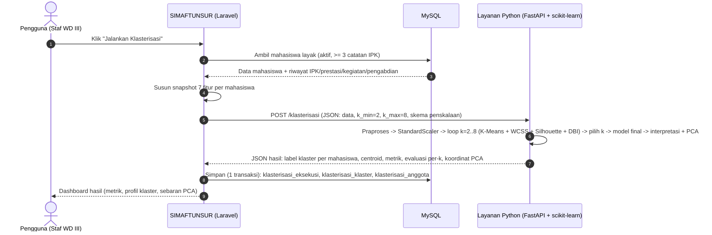

# Draf Materi Naskah — Konsep scikit-learn, Rumus, dan Integrasi ML ↔ Sistem Informasi

> **Menjawab feedback dosen 2 Juli 2026** (poin: konsep scikit-learn, cara
> integrasi ML dengan sistem berjalan, alur hasil perhitungan kembali ke SI,
> perhitungan rumus, tahapan ML). Materi ini adalah **draf untuk dipindahkan ke
> naskah DOCX** (BAB II untuk konsep & rumus; BAB III untuk arsitektur
> integrasi & contoh perhitungan — sesuaikan penempatan dengan arahan pembimbing).
>
> Seluruh angka contoh perhitungan di §4 dihitung dua kali: manual (langkah demi
> langkah) dan dengan scikit-learn — **hasilnya identik**, sehingga aman dikutip.

---

## 1. Konsep scikit-learn (untuk Tinjauan Pustaka)

### 1.1 Pengertian

Scikit-learn adalah pustaka (*library*) *machine learning* sumber terbuka untuk
bahasa pemrograman Python yang menyediakan implementasi siap pakai berbagai
algoritma pembelajaran mesin — termasuk klasterisasi, klasifikasi, regresi,
reduksi dimensi, dan pra-pemrosesan data — di atas fondasi komputasi numerik
NumPy dan SciPy (McKinney, 2022; Primartha, 2021). Pustaka ini dipilih karena:

1. **Konsistensi antarmuka (estimator API).** Setiap algoritma dibungkus sebagai
   objek *estimator* dengan pola pemakaian seragam: `fit()` untuk melatih model
   dari data, `predict()` untuk menerapkan model pada data, dan `transform()`
   untuk mengubah representasi data. Keseragaman ini membuat pipeline mudah
   disusun dan diganti komponennya.
2. **Implementasi teruji dan terdokumentasi**, dipakai luas di industri dan
   penelitian, sehingga hasil komputasi dapat direproduksi.
3. **Tidak memerlukan data besar atau GPU** — sesuai kondisi data penelitian
   (ratusan mahasiswa).

### 1.2 Komponen scikit-learn yang digunakan dalam penelitian

| Komponen | Modul | Fungsi dalam penelitian |
|---|---|---|
| `StandardScaler` | `sklearn.preprocessing` | Penskalaan fitur z = (x − μ)/σ agar fitur berbeda satuan (IPK 0–4 vs skor SKKM) berbobot setara dalam jarak Euclidean |
| `KMeans` | `sklearn.cluster` | Algoritma klasterisasi inti; inisialisasi `k-means++`, `n_init=10`, `random_state=42` agar hasil deterministik/reprodusibel |
| `silhouette_score` | `sklearn.metrics` | Evaluasi internal kohesi–separasi klaster; dasar pemilihan k optimal |
| `davies_bouldin_score` | `sklearn.metrics` | Evaluasi internal rasio sebaran intra-klaster terhadap jarak antar-klaster (pembanding) |
| `inertia_` (atribut `KMeans`) | `sklearn.cluster` | Nilai WCSS untuk kurva Metode Elbow (pembanding) |
| `PCA` | `sklearn.decomposition` | Proyeksi 7 fitur ke 2 dimensi untuk visualisasi sebaran klaster (bukan bagian pemodelan) |

Parameter penting `KMeans` yang perlu dijelaskan di naskah:

- **`init="k-means++"`** — centroid awal *tidak* murni acak: centroid pertama
  dipilih acak, centroid berikutnya dipilih dengan peluang sebanding kuadrat
  jarak titik ke centroid terdekat yang sudah ada, sehingga centroid awal
  menyebar dan mengurangi risiko konvergensi ke solusi lokal yang buruk
  (menjawab pertanyaan pembimbing 1 Juli soal "kenapa centroid awal acak").
- **`n_init=10`** — algoritma dijalankan 10 kali dengan inisialisasi berbeda,
  diambil hasil dengan WCSS terkecil.
- **`random_state=42`** — benih acak dikunci agar setiap eksekusi menghasilkan
  klaster yang sama (reprodusibilitas ilmiah; nilai ini juga disimpan ke basis
  data pada tabel `klasterisasi_eksekusi.random_state` sebagai jejak audit).

### 1.3 Kedudukan dalam tahapan machine learning

Tahapan pemodelan (selaras fase CRISP-DM pada komponen klasterisasi):

1. **Pengumpulan data** — SI menyediakan data mahasiswa layak (aktif, ≥ 3
   catatan IPK) beserta 7 fitur.
2. **Pra-pemrosesan** (`preprocess`) — penanganan *missing value*, *outlier*,
   dan *encoding*.
3. **Rekayasa fitur** (`feature_engineering`) — seleksi fitur dan penskalaan
   `StandardScaler`.
4. **Pemodelan** (`train`) — pelatihan `KMeans` per kandidat k (2–8) lalu model
   final.
5. **Evaluasi** (`evaluate`) — Silhouette, DBI, WCSS/Elbow (metrik internal,
   bukan akurasi, karena *unsupervised*).
6. **Interpretasi & deployment** (`interpret`) — profil centroid per fitur,
   proyeksi PCA, lalu hasil dikirim kembali ke SI (§5).

---

## 2. Rumus dan Tahapan Perhitungan Tiap Metode

### 2.1 Penskalaan StandardScaler

$$z_{im} = \frac{x_{im} - \mu_m}{\sigma_m}$$

dengan $\mu_m$ = rata-rata fitur ke-$m$ dan $\sigma_m$ = simpangan baku
(populasi) fitur ke-$m$. Hasilnya setiap fitur bernilai rata-rata 0 dan
simpangan baku 1.

### 2.2 K-Means dan jarak Euclidean

Fungsi tujuan K-Means meminimalkan jumlah kuadrat jarak dalam klaster:

$$J = \sum_{j=1}^{k} \sum_{x_i \in C_j} \lVert x_i - c_j \rVert^2$$

Jarak Euclidean antara titik $x_i$ dan centroid $c_j$ pada $m$ fitur:

$$d(x_i, c_j) = \sqrt{\sum_{m=1}^{M} (x_{im} - c_{jm})^2}$$

Pembaruan centroid (rata-rata anggota klaster):

$$c_j = \frac{1}{|C_j|} \sum_{x_i \in C_j} x_i$$

**Tahapan (lihat FC-02):** (1) tentukan k centroid awal dengan k-means++;
(2) hitung jarak Euclidean tiap titik ke tiap centroid; (3) tugaskan titik ke
centroid terdekat; (4) hitung ulang centroid; (5) ulangi 2–4 sampai centroid
tidak berubah (Han, Kamber & Pei, 2022).

### 2.3 Metode Elbow (WCSS)

$$WCSS_k = \sum_{j=1}^{k} \sum_{x_i \in C_j} \lVert x_i - c_j \rVert^2$$

**Tahapan (lihat FC-03):** hitung $WCSS_k$ untuk tiap kandidat k; susun kurva k
terhadap WCSS; titik siku (penurunan mulai melandai) menjadi kandidat k optimal
(Sholeh, Ghufron & Fatkhiyah, 2022).

### 2.4 Silhouette Coefficient

Untuk tiap titik $i$:

$$a(i) = \text{rata-rata jarak } i \text{ ke titik lain di klaster yang sama}$$
$$b(i) = \min_{C \neq C_i}\ \text{rata-rata jarak } i \text{ ke seluruh titik klaster } C$$
$$s(i) = \frac{b(i) - a(i)}{\max\{a(i),\, b(i)\}}$$

Silhouette Coefficient = rata-rata $s(i)$ seluruh titik; rentang −1 s.d. +1,
makin mendekati +1 makin baik (Hasan, Wahyudi & Hendra, 2024; Suryaningrum
dkk., 2023).

**Tahapan (lihat FC-04):** hitung a(i) (kohesi), b(i) (separasi), s(i) per
titik, lalu rata-ratakan.

### 2.5 Davies-Bouldin Index

$$S_i = \frac{1}{|C_i|} \sum_{x \in C_i} d(x, c_i) \qquad
M_{ij} = \lVert c_i - c_j \rVert$$

$$R_{ij} = \frac{S_i + S_j}{M_{ij}} \qquad
DBI = \frac{1}{k} \sum_{i=1}^{k} \max_{j \neq i} R_{ij}$$

Makin **kecil** DBI makin baik: sebaran intra-klaster kecil relatif terhadap
jarak antar-klaster (Sholeh dkk., 2022; Hasan dkk., 2024).

**Tahapan (lihat FC-05):** hitung $S_i$ per klaster → $M_{ij}$ per pasangan →
$R_{ij}$ → ambil maksimum per klaster → rata-ratakan.

### 2.6 Aturan pemilihan k pada penelitian ini

k optimal = kandidat k (2–8) dengan **Silhouette Coefficient tertinggi**;
kurva Elbow dan nilai DBI per-k disajikan sebagai **pembanding** dan bahan
diskusi (implementasi: `ml/pipeline/train.py::pilih_k_optimal`).

---

## 3. Data Contoh Perhitungan

Enam mahasiswa fiktif, dua fitur (agar dapat dihitung manual; pada sistem nyata
7 fitur):

| Mahasiswa | IPK rata-rata (x₁) | Skor prestasi (x₂) |
|---|---|---|
| M1 | 3,80 | 8 |
| M2 | 3,60 | 7 |
| M3 | 3,50 | 6 |
| M4 | 2,60 | 1 |
| M5 | 2,40 | 2 |
| M6 | 2,20 | 0 |

> Data ini **contoh ilustrasi perhitungan**, bukan data penelitian — jangan
> diklaim sebagai hasil (aturan integritas naskah).

---

## 4. Contoh Perhitungan Langkah demi Langkah

### 4.1 Penskalaan StandardScaler

Rata-rata: μ₁ = 3,0167; μ₂ = 4,0000. Simpangan baku: σ₁ = 0,6336; σ₂ = 3,1091.
Contoh M1: z₁ = (3,80 − 3,0167)/0,6336 = **1,2364**; z₂ = (8 − 4)/3,1091 =
**1,2865**.

| | z₁ | z₂ |
|---|---|---|
| M1 | 1,2364 | 1,2865 |
| M2 | 0,9207 | 0,9649 |
| M3 | 0,7629 | 0,6433 |
| M4 | −0,6577 | −0,9649 |
| M5 | −0,9733 | −0,6433 |
| M6 | −1,2890 | −1,2865 |

### 4.2 Iterasi K-Means (k = 2; ilustrasi centroid awal = M1 dan M6)

**Iterasi 1** — jarak Euclidean tiap titik ke C1 (=M1) dan C2 (=M6):

| Titik | d ke C1 | d ke C2 | Klaster |
|---|---|---|---|
| M1 | 0,0000 | 3,6053 | 1 |
| M2 | 0,4507 | 3,1547 | 1 |
| M3 | 0,7988 | 2,8168 | 1 |
| M4 | 2,9422 | 0,7086 | 2 |
| M5 | 2,9338 | 0,7166 | 2 |
| M6 | 3,6053 | 0,0000 | 2 |

Contoh perhitungan d(M2, C1) = √((0,9207−1,2364)² + (0,9649−1,2865)²) =
√(0,0997 + 0,1034) = **0,4507**.

Centroid baru: C1 = rata-rata M1–M3 = (0,9733; 0,9649), C2 = rata-rata M4–M6 =
(−0,9733; −0,9649).

**Iterasi 2** — penugasan tidak berubah, centroid baru identik → **konvergen**.

### 4.3 WCSS (bahan Elbow), k = 2

Kuadrat jarak tiap titik ke centroidnya: 0,1727 + 0,0028 + 0,1477 + 0,0997 +
0,1034 + 0,2031 = **WCSS = 0,7294**.

### 4.4 Silhouette Coefficient, k = 2

| Titik | a(i) | b(i) | s(i) |
|---|---|---|---|
| M1 | 0,6247 | 3,1604 | 0,8023 |
| M2 | 0,4045 | 2,7108 | 0,8508 |
| M3 | 0,5785 | 2,3745 | 0,7564 |
| M4 | 0,5796 | 2,5270 | 0,7706 |
| M5 | 0,5836 | 2,5265 | 0,7690 |
| M6 | 0,7126 | 3,1923 | 0,7768 |

Silhouette Coefficient = rata-rata s(i) = **0,7877** (mendekati +1 → struktur
klaster kuat).

### 4.5 Davies-Bouldin Index, k = 2

S₁ = 0,2842; S₂ = 0,3627; M₁₂ = 2,7411.
R₁₂ = (0,2842 + 0,3627)/2,7411 = **0,2360** → DBI = **0,2360** (kecil → baik).

### 4.6 Rekap evaluasi per-k dan pemilihan k (silang-cek scikit-learn)

| k | WCSS (Elbow) | Silhouette | DBI |
|---|---|---|---|
| **2** | 0,7294 | **0,7877** | **0,2360** |
| 3 | 0,4247 | 0,5152 | 0,2897 |
| 4 | 0,1657 | 0,2486 | 0,3104 |

k = 2 terpilih: Silhouette tertinggi, DBI terkecil, dan siku kurva Elbow.
Perhitungan manual §4.1–4.5 **identik** dengan keluaran
`StandardScaler`/`KMeans`/`silhouette_score`/`davies_bouldin_score`
scikit-learn (`random_state=42`, `n_init=10`) — membuktikan naskah dan
implementasi konsisten.

---

## 5. Integrasi Machine Learning dengan Sistem Informasi Berjalan

### 5.1 Arsitektur

Dua proses terpisah yang berkomunikasi melalui REST API di jaringan lokal:

1. **SIMAFTUNSUR (Laravel + MySQL)** — sistem informasi kemahasiswaan tempat
   data dikelola dan hasil ditampilkan; **sudah siap pakai** sebagai "bangunan
   besar".
2. **Layanan klasterisasi (Python + FastAPI + scikit-learn)** — proses terpisah
   (`uvicorn api:app --port 8001`) yang **hanya** menangani komputasi
   machine learning; tanpa akses langsung ke basis data.

Pemisahan ini membuat komponen ML dapat dikembangkan/diuji terpisah dan SI
tidak bergantung pada runtime Python untuk fungsi non-ML.

### 5.2 Alur permintaan (SI → ML)

`App\Services\KlasterisasiService::jalankan()` menyiapkan muatan JSON berisi
identitas mahasiswa + nilai 7 fitur, lalu mengirim `POST /klasterisasi`
(alamat layanan dari konfigurasi `services.ml.base_url`, default
`http://127.0.0.1:8001`, batas waktu 60 detik). Ketersediaan layanan diperiksa
lebih dulu lewat `GET /sehat`. Bila layanan mati atau data tidak valid, SI
menampilkan pesan galat yang jelas — tidak ada perhitungan cadangan di PHP,
sehingga seluruh komputasi ML terjadi di satu tempat (scikit-learn).

### 5.3 Alur hasil (ML → SI) — jawaban "hasil scikit-learn dikirim ke mana"

Layanan Python **mengembalikan hasil sebagai respons JSON pada permintaan yang
sama** (pola *request–response* sinkron; SI yang mengambil, layanan tidak
menulis apa pun). Struktur intinya:

- `metrik` — silhouette, davies_bouldin, inertia model final;
- `evaluasi_k` — tabel WCSS/Silhouette/DBI per kandidat k (bahan grafik Elbow);
- `profil_klaster` — centroid per fitur (satuan asli & terskala) + jumlah anggota;
- `hasil` — per mahasiswa: label klaster, jarak ke centroid, koordinat PCA;
- `peringatan` — mis. volume data di bawah ambang ideal 100.

`KlasterisasiService::simpan()` lalu menyimpan seluruh respons itu ke MySQL
dalam **satu transaksi** ke tiga tabel:

| Tabel | Isi |
|---|---|
| `klasterisasi_eksekusi` | Metadata eksekusi: k terpilih, metode pemilihan k, fitur yang dipakai, `random_state`, metrik final, tabel evaluasi per-k, siapa yang menjalankan |
| `klasterisasi_klaster` | Satu baris per klaster: centroid, label deskriptif, jumlah anggota, interpretasi |
| `klasterisasi_anggota` | Satu baris per mahasiswa: klaster, *snapshot* nilai fitur saat eksekusi, jarak ke centroid, koordinat PCA |

Karena hasil **dipersistenkan** (bukan dihitung ulang tiap kali dibuka),
dashboard dapat menampilkan riwayat eksekusi, hasilnya dapat diaudit
(snapshot fitur membekukan justifikasi pengelompokan), dan layanan Python tidak
perlu hidup saat pimpinan membaca hasil.

### 5.4 Ringkasan cara mengimplementasikan ML dalam aplikasi

1. SI mengumpulkan dan membersihkan data (modul Data Mahasiswa, IPK, Prestasi,
   Kegiatan, Pengabdian).
2. SI membekukan vektor fitur dan memanggil layanan ML via REST API.
3. Layanan ML menjalankan pipeline scikit-learn (praproses → penskalaan →
   K-Means → evaluasi → interpretasi) dan mengembalikan JSON.
4. SI menyimpan hasil ke basis data relasional dan menyajikannya sebagai
   dashboard keputusan bagi WD III/pimpinan.

---

## 6. Catatan Sitasi

Sudah ada di daftar pustaka: Han dkk. (2022) — K-Means & jarak Euclidean;
Sholeh dkk. (2022) — perbandingan Elbow/Silhouette/DBI; Hasan dkk. (2024) &
Suryaningrum dkk. (2023) — Silhouette & DBI; Primartha (2021) — algoritma ML;
McKinney (2022) — ekosistem Python/NumPy/Pandas.

**Saran tambahan (≥ 2015) khusus konsep scikit-learn** — konfirmasikan ke
pembimbing sebelum ditambahkan:
- Géron, A. (2022). *Hands-On Machine Learning with Scikit-Learn, Keras, and
  TensorFlow* (3rd ed.). O'Reilly — penjelasan estimator API & K-Means praktis.
- Dokumentasi resmi scikit-learn (scikit-learn developers, 2025),
  https://scikit-learn.org — rujukan parameter `KMeans`, `k-means++`, metrik.
