# Daftar Simbol — SIMAFTUNSUR (siap copas ke Word)

> Kumpulan semua simbol yang dipakai pada diagram (Flowchart, ERD, Use Case,
> Activity, Class) dan rumus di naskah.
> **Bagian A** = simbol diagram → tersedia sebagai **gambar PNG terpisah**
> (Insert → Picture ke Word). **Bagian B** = simbol matematika/teks → **salin
> karakternya** langsung. Terakhir diperbarui: 2026-07-11.
>
> **Tips Word:** karakter Bagian B bisa juga diketik dengan mengetik **kode
> Unicode** lalu **Alt+X** (mis. `221A` + Alt+X → √). Subskrip: **Ctrl + =**;
> superskrip: **Ctrl + Shift + =**. Rumus rapi: **Insert → Equation (Alt + =)**.

---

# BAGIAN A — Simbol Diagram (gambar PNG)

Semua gambar ada di **`docs/gambar/simbol/`**, latar putih, tanpa transparansi.
Regenerasi otomatis dari sumber teks `docs/vp-import/simbol/*.puml`:

```
powershell -ExecutionPolicy Bypass -File tools\render-simbol.ps1
```

Seluruh simbol disatukan dalam **satu tabel**; kolom *Diagram* menunjukkan
diagram tempat simbol itu dipakai.

| No | Gambar | Nama simbol | Diagram | Fungsi |
|---|---|---|---|---|
| 1 | 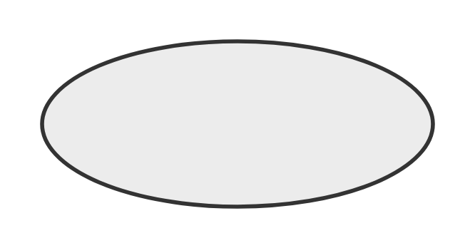 | *Terminator* | Flowchart | Menyatakan **mulai** atau **selesai** proses |
| 2 | 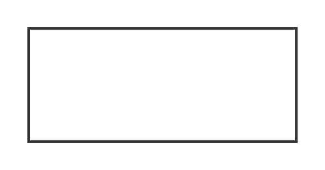 | *Process* | Flowchart | Langkah **proses / komputasi** |
| 3 | 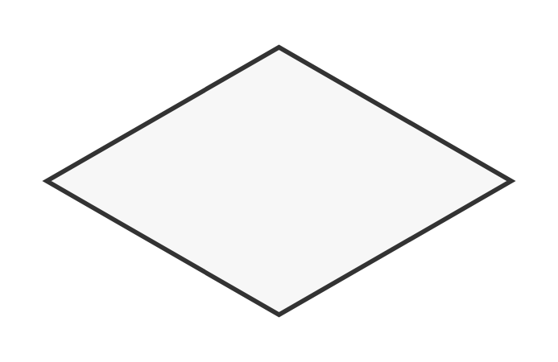 | *Decision* | Flowchart | **Percabangan** keputusan (Ya/Tidak) |
| 4 | 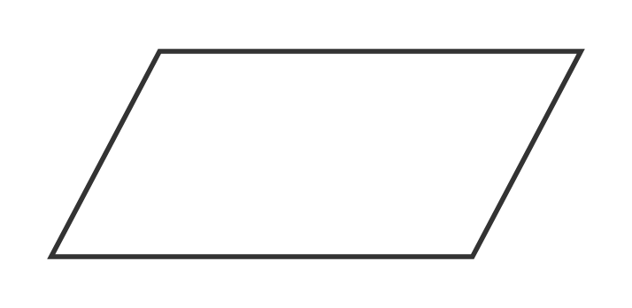 | *Data (Input/Output)* | Flowchart | **Masukan / keluaran** data |
| 5 | 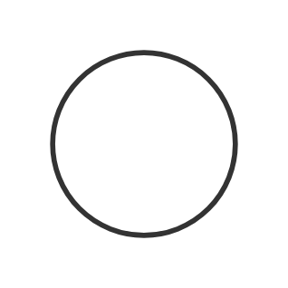 | *Connector* | Flowchart | **Penghubung** alur dalam satu halaman |
| 6 | 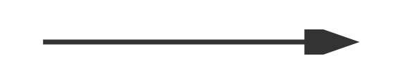 | *Flow line* | Flowchart | **Arah / urutan** alur antar simbol |
| 7 | 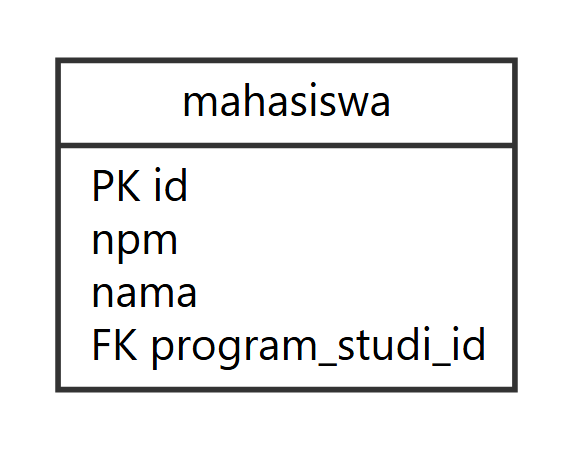 | Entitas | ERD | **Objek/tabel data**; nama di kepala, atribut di badan, **PK**/**FK** ditandai |
| 8 | 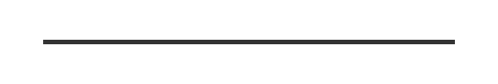 | Garis relasi | ERD | **Hubungan** antar-entitas |
| 9 |  | Satu — `1` | ERD | Kardinalitas **satu dan hanya satu** (dua garis) |
| 10 |  | Nol atau satu — `0..1` | ERD | Opsional, **maksimum satu** (lingkaran + garis) |
| 11 |  | Satu atau banyak — `1..*` | ERD | **Minimal satu**, boleh banyak (kaki gagak + garis) |
| 12 |  | Nol atau banyak — `0..*` | ERD | Opsional, **boleh banyak** (kaki gagak + lingkaran) |
| 13 | 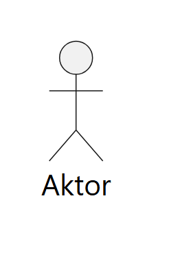 | Aktor | Use Case | **Pengguna / sistem eksternal** yang berinteraksi dengan sistem |
| 14 | 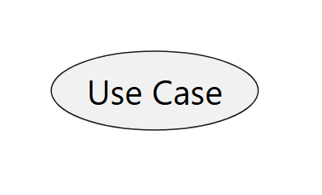 | Use Case | Use Case | **Fungsi / layanan** yang disediakan sistem |
| 15 | 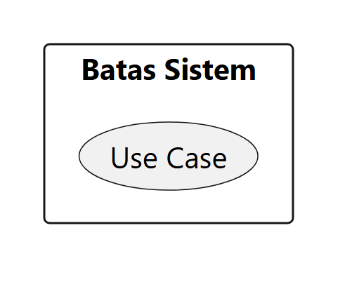 | Batas Sistem (*boundary*) | Use Case | **Ruang lingkup** sistem |
| 16 | 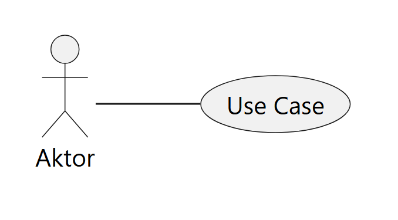 | Asosiasi | Use Case | **Interaksi** aktor–use case |
| 17 | 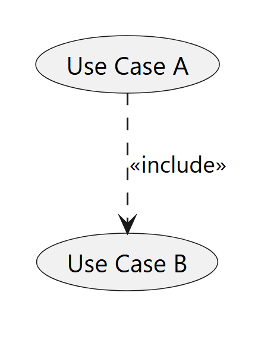 | «include» | Use Case | Use case **selalu memanggil** use case lain |
| 18 | 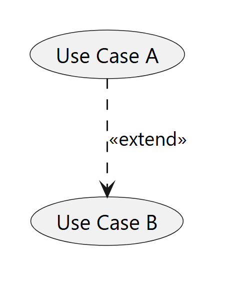 | «extend» | Use Case | **Perluasan** opsional/kondisional sebuah use case |
| 19 | 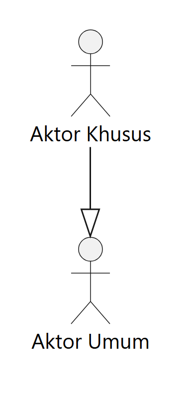 | Generalisasi | Use Case | **Pewarisan** antar-aktor / use case (segitiga kosong) |
| 20 | 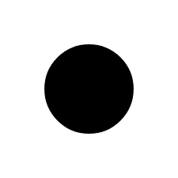 | *Initial node* | Activity | **Titik awal** aktivitas |
| 21 | 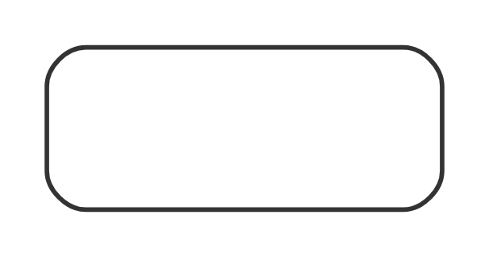 | *Action* | Activity | **Satu langkah** aktivitas/aksi |
| 22 | 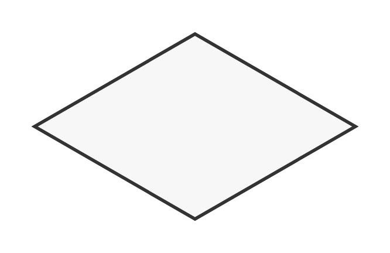 | *Decision / Merge* | Activity | **Percabangan / penggabungan** alur (*guard* `[Ya]`/`[Tidak]`) |
| 23 |  | *Fork / Join* | Activity | **Pemisahan / penggabungan** alur paralel |
| 24 | 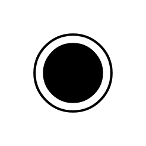 | *Activity Final node* | Activity | **Titik akhir** aktivitas |
| 25 |  | *Control flow* | Activity | **Arah / urutan** aktivitas |
| 26 | 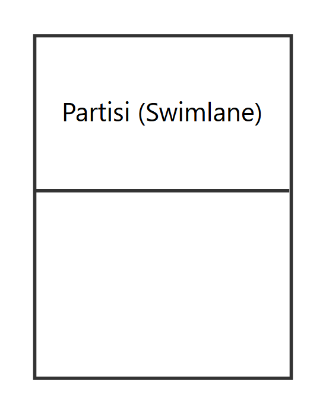 | *Swimlane / Partition* | Activity | **Pengelompokan** aktivitas per pelaku |
| 27 | 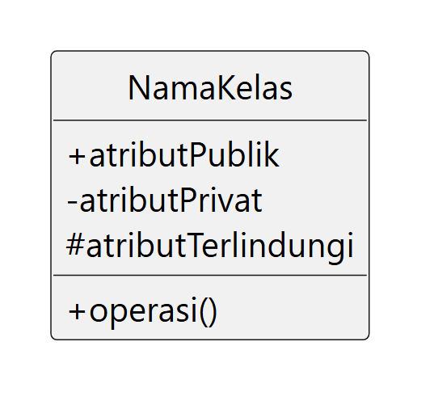 | Kelas | Class | Nama, atribut, operasi; **visibilitas** `+` publik, `−` privat, `#` terlindungi |
| 28 | 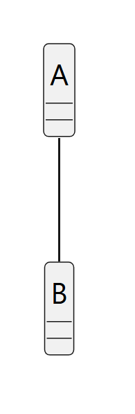 | Asosiasi | Class | **Hubungan** antar-kelas |
| 29 | 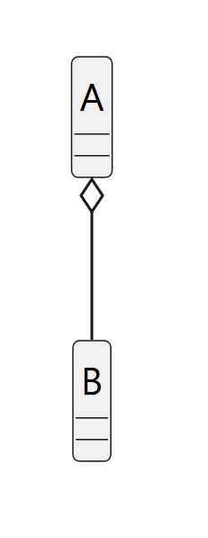 | Agregasi | Class | Relasi **"punya"** — bagian bisa berdiri sendiri (belah ketupat kosong) |
| 30 | 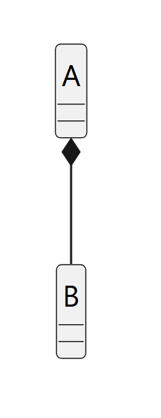 | Komposisi | Class | Relasi **"bagian dari"** — bagian bergantung penuh (belah ketupat terisi) |
| 31 | 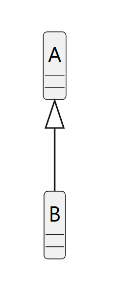 | Generalisasi | Class | **Pewarisan** (segitiga kosong) |
| 32 | 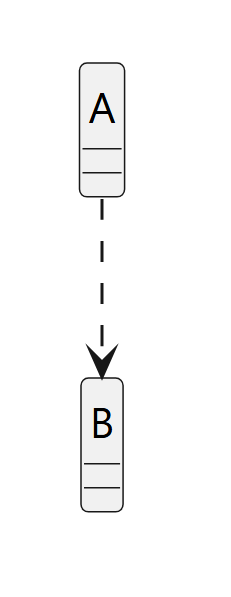 | Dependensi | Class | **Ketergantungan** (panah putus-putus) |
| 33 | 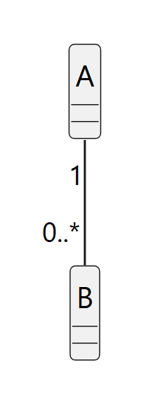 | Multiplisitas | Class | **Jumlah** objek yang berelasi (`1`, `0..*`) |

> Standar notasi: **Flowchart** ISO 5807:1985; **ERD** *crow's foot*
> (*Information Engineering*); **Use Case, Activity, Class** UML 2.5.1 (OMG).
> Semua sumber teks tersimpan di `docs/vp-import/simbol/` (prefiks `SIM-`,
> `ERD-`, `UC-`, `AD-`, `CD-`).

---

# BAGIAN B — Simbol Matematika & Teks (salin karakter)

## B.1 Simbol matematika & rumus

| Simbol | Nama | Unicode (Alt+X) | Makna dalam naskah | Contoh |
|---|---|---|---|---|
| − | Tanda minus | `2212` | Pengurangan (bukan hyphen `-`) | x − μ |
| √ | Akar kuadrat | `221A` | Akar pada jarak Euclidean | √( Σ … ) |
| Σ | Sigma kapital (penjumlahan) | `03A3` | Penjumlahan | Σ (x − c)² |
| ∑ | N-ary summation | `2211` | Varian penjumlahan gaya rumus | ∑ⱼ ∑ₓ |
| ‖ ‖ | Garis ganda (norm) | `2016` | Norma/panjang vektor | ‖x − c_j‖² |
| ∈ | Elemen dari | `2208` | "titik anggota klaster" | x ∈ Cⱼ |
| ≠ | Tidak sama dengan | `2260` | Pasangan klaster berbeda | j ≠ i |
| ≥ | Lebih besar / sama | `2265` | Syarat data (≥ 3 semester) | ≥ 3 catatan IPK |
| ≤ | Lebih kecil / sama | `2264` | Batas rentang | 0 ≤ s ≤ 1 |
| ² | Pangkat dua | `00B2` | Kuadrat | (x − c)² |
| μ | Mu (rata-rata) | `03BC` | Rata-rata populasi fitur | μ = rata-rata |
| σ | Sigma kecil (simpangan baku) | `03C3` | Simpangan baku fitur | z = (x − μ)/σ |
| × | Kali | `00D7` | Perkalian (bukan huruf x) | 2 × 3 |
| · | Titik tengah (dot) | `00B7` | Perkalian titik | a · b |
| ± | Plus-minus | `00B1` | Rentang toleransi | 0,5 ± 0,1 |
| ∞ | Tak hingga | `221E` | Batas | k → ∞ |
| ≈ | Kira-kira sama | `2248` | Nilai hampiran | s ≈ 0,79 |
| → | Panah kanan | `2192` | "menuju / menghasilkan" | ML → SI |
| ↔ | Panah dua arah | `2194` | Integrasi timbal balik | ML ↔ SI |

## B.2 Subskrip & superskrip (indeks variabel)

Paling rapi pakai **Ctrl + =** (subskrip) / **Ctrl + Shift + =** (superskrip),
atau salin karakter jadi berikut.

| Superskrip | Unicode | | Subskrip | Unicode |
|---|---|---|---|---|
| ⁰ | `2070` | | ₀ | `2080` |
| ¹ | `00B9` | | ₁ | `2081` |
| ² | `00B2` | | ₂ | `2082` |
| ³ | `00B3` | | ₃ | `2083` |
| ⁴ | `2074` | | ₄ | `2084` |
| ⁿ | `207F` | | ₉ | `2089` |
| | | | ᵢ ⱼ ₘ ₖ | huruf indeks (i, j, m, k) |

Contoh dari naskah: **x₁, x₂, z₁, z₂, μ₁, σ₂, S₁, M₁₂, R₁₂, xᵢ, cⱼ, WCSSₖ**.

## B.3 Notasi teks UML (untuk diketik di label)

| Simbol | Nama | Unicode | Makna |
|---|---|---|---|
| « » | *Guillemet* (petik sudut) | `00AB` / `00BB` | Stereotype: «include», «extend», «use» |
| + | Public | — | Visibilitas atribut/operasi kelas |
| − | Private | `2212` | Visibilitas privat |
| # | Protected | — | Visibilitas terlindungi |
| [Ya] / [Tidak] | *Guard* | — | Kondisi cabang pada Activity Diagram |

Kardinalitas ERD (teks): `1`, `0..1`, `0..*`, `1..*`.

## B.4 Contoh rumus lengkap (siap tempel)

Salin baris berikut; untuk tampilan formal ketik ulang di **Insert → Equation**.

- Penskalaan (StandardScaler): **z = (x − μ) / σ**
- Jarak Euclidean: **d(xᵢ, cⱼ) = √( Σₘ (xᵢₘ − cⱼₘ)² )**
- Fungsi tujuan K-Means: **J = Σⱼ Σ (xᵢ ∈ Cⱼ) ‖xᵢ − cⱼ‖²**
- WCSS (Elbow): **WCSSₖ = Σⱼ Σ (xᵢ ∈ Cⱼ) ‖xᵢ − cⱼ‖²**
- Silhouette: **s(i) = ( b(i) − a(i) ) / max{ a(i), b(i) }**
- Davies-Bouldin: **DBI = (1/k) Σᵢ maxⱼ≠ᵢ Rᵢⱼ**, dengan **Rᵢⱼ = (Sᵢ + Sⱼ) / Mᵢⱼ**
