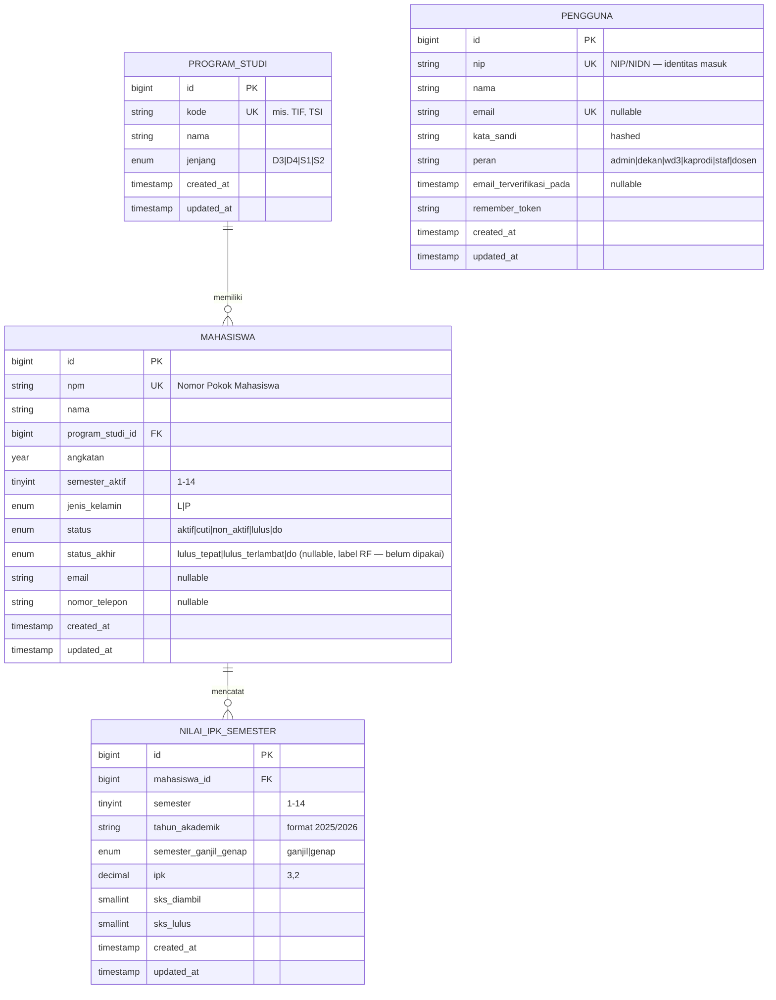
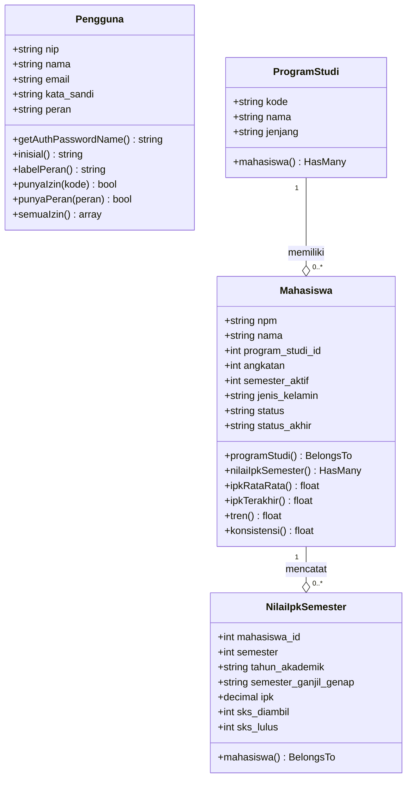
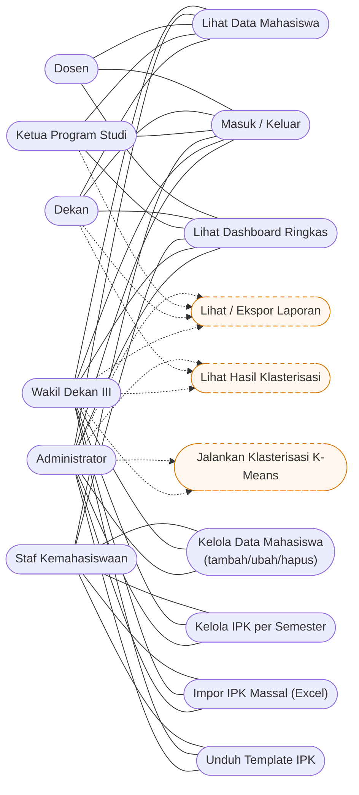
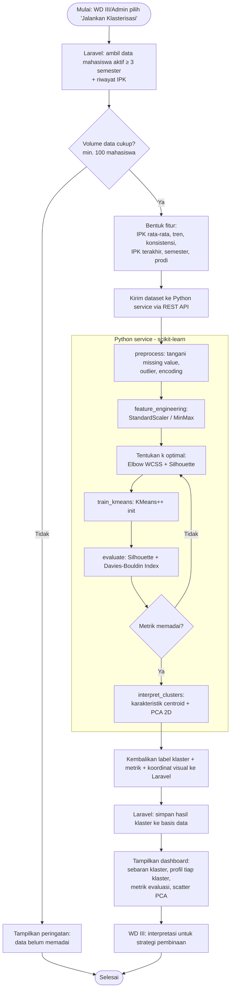

# Sumber Teks Diagram BAB III — SIMAFTUNSUR

> **Tujuan:** sumber teks (Mermaid) untuk diagram perancangan sistem pada BAB III, **diturunkan dari codebase nyata** (bukan skema asumsi). Mudah direvisi pembimbing & dirender ulang (mis. di mermaid.live, VS Code Mermaid Preview, atau diekspor PNG/SVG untuk dokumen).
>
> **Diselaraskan dengan:** migrations `database/migrations/`, Models `app/Models/`, `routes/web.php`, `config/peran.php`, middleware `app/Http/Middleware/Peran.php`, dan Fortify.
> **Terakhir diperbarui:** 2026-06-24.
>
> **Cakupan:** hanya tabel/relasi **bisnis**. Tabel sistem Laravel (`cache`, `jobs`, `sessions`, `password_reset_tokens`, `migrations`) **sengaja dibuang** sesuai ketentuan naskah.

---

## 1. ERD — Entity Relationship Diagram (tabel bisnis)

Empat tabel bisnis: `program_studi`, `mahasiswa`, `nilai_ipk_semester`, `pengguna`.
Kolom `status_akhir` pada `mahasiswa` disiapkan untuk pengembangan lanjutan (Random Forest, BAB V) dan **belum dipakai** pada klasterisasi K-Means.



**Catatan relasi:**
- `mahasiswa.program_studi_id` → `program_studi.id` (`restrictOnDelete` — prodi tak bisa dihapus bila masih punya mahasiswa).
- `nilai_ipk_semester.mahasiswa_id` → `mahasiswa.id` (`cascadeOnDelete` — hapus mahasiswa ikut menghapus riwayat IPK).
- `pengguna` berdiri sendiri (entitas autentikasi/RBAC), tidak ber-FK ke entitas bisnis. RBAC dipetakan statis di `config/peran.php` (bukan tabel), sehingga **tidak ada tabel `roles`/`permissions`**.
- Constraint unik gabungan: `nilai_ipk_semester (mahasiswa_id, semester)` — satu mahasiswa hanya boleh punya satu catatan per semester.

---

## 2. Class Diagram (Model Eloquent)

Mencerminkan kelas pada `app/Models/`, atribut utama, dan **method domain** yang menyiapkan fitur klasterisasi (rata-rata, tren, konsistensi IPK).



**Catatan fitur klasterisasi (sudah ada di Model `Mahasiswa`):**
- `ipkRataRata()` — rata-rata IPK seluruh semester.
- `tren()` — slope regresi linear sederhana terhadap urutan semester (positif = naik, negatif = turun). *Catatan: ini perhitungan tren deskriptif untuk fitur, **bukan** Regresi Linier sebagai metode prediksi — metode inti tetap K-Means.*
- `konsistensi()` — standar deviasi populasi IPK (kecil = stabil, besar = fluktuatif).

Ketiga method ini menjadi **kandidat fitur** yang diekspor ke pipeline K-Means.

---

## 3. Use Case Diagram

Aktor diturunkan dari peran di `config/peran.php`; use case dari `routes/web.php` + izin (`@can` / `abort_unless`) + Fortify (login/logout).
Use case **bergaris putus-putus = direncanakan** (modul masih placeholder/disabled di sidebar): Klasterisasi & Laporan.



**Pemetaan aktor ↔ izin (`config/peran.php`):**

| Aktor (peran) | Izin terdefinisi |
|---|---|
| Administrator (`admin`) | `*` (seluruh izin) |
| Wakil Dekan III (`wd3`) | `mahasiswa.kelola`, `klasterisasi.lihat`, `klasterisasi.jalankan`, `laporan.lihat`, `laporan.ekspor` |
| Staf Kemahasiswaan (`staf`) | `mahasiswa.kelola`, `ipk.kelola` |
| Ketua Program Studi (`kaprodi`) | `mahasiswa.lihat`, `laporan.lihat` |
| Dekan (`dekan`) | `mahasiswa.lihat`, `klasterisasi.lihat`, `laporan.lihat` |
| Dosen (`dosen`) | `mahasiswa.lihat` |

> **Catatan konsistensi:** izin `ipk.kelola` terdefinisi untuk `staf`, tetapi gate nyata pada pengelolaan IPK di `detail.blade.php` memakai `mahasiswa.kelola` (yang juga dimiliki staf), sehingga fungsional tetap benar. Pertimbangkan menyatukan keduanya saat membangun modul IPK lanjutan.

---

## 4. Activity Diagram — Alur Klasterisasi K-Means

Memetakan tahapan penerapan K-Means (naskah BAB III, kerangka CRISP-DM yang terintegrasi ke Waterfall). Menggambarkan pembagian tanggung jawab: **Laravel (SI)** ↔ **Python service (scikit-learn)**.

> Status: pipeline ini **belum diimplementasikan** (rencana tahap berikutnya). Diagram ini = rancangan acuan untuk BAB III.



**Catatan teknis:**
- Atribut fitur sumber: method `ipkRataRata()`, `tren()`, `konsistensi()`, `ipkTerakhir()` pada Model `Mahasiswa` + `semester_aktif` + `program_studi_id`.
- Evaluasi **internal** (unsupervised): Silhouette Coefficient, Davies-Bouldin Index, Elbow (WCSS) — **bukan** Accuracy/Precision/Recall.
- Penentuan `k` memakai kombinasi Elbow + Silhouette (sesuai naskah).
- Kolom `status_akhir` **tidak** dijadikan fitur klasterisasi (itu label untuk RF, BAB V).

---

## Cara render / ekspor

- **Online:** salin tiap blok ```mermaid``` ke <https://mermaid.live> → ekspor PNG/SVG.
- **VS Code:** ekstensi *Markdown Preview Mermaid Support*.
- **CLI (opsional):** `mmdc -i docs/diagram-bab3.md -o keluaran.svg` (paket `@mermaid-js/mermaid-cli`).

> Untuk dokumen Word: render ke SVG/PNG lalu sisipkan; simpan sumber `.md` ini sebagai lampiran agar pembimbing dapat meminta revisi pada teksnya, bukan pada gambar.
