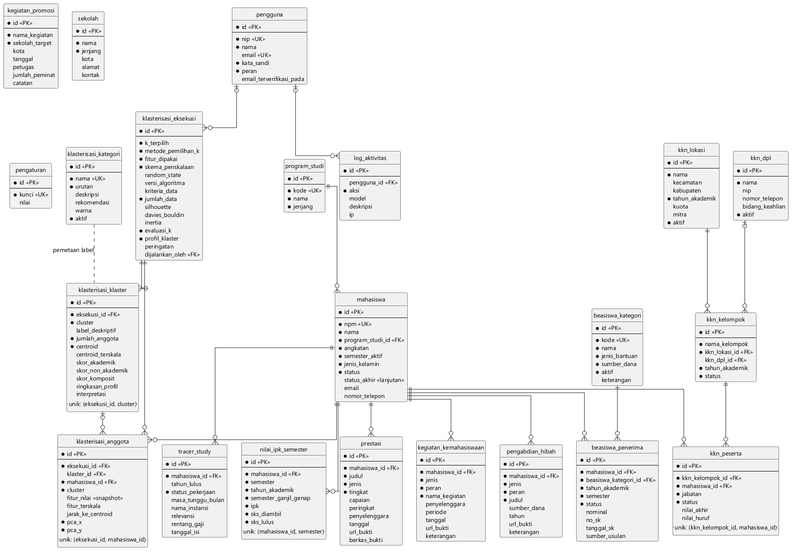

# ERD Lengkap SIMAFTUNSUR — untuk cetak 1 halaman A4 landscape

Menjawab masukan pembimbing: **seluruh entitas dan relasi ditampilkan utuh
dalam satu gambar**, bukan dipecah, dan dicetak pada **kertas A4 orientasi
landscape** agar semua relasi terlihat dalam satu halaman.

| Berkas | Keterangan |
|---|---|
| `docs/vp-import/simaftunsur-erd-lengkap.puml` | Sumber teks (PlantUML, notasi *crow's foot*) |
| `docs/gambar/ERD-Lengkap.png` | Gambar siap tempel (latar putih, 1591 × 1108 px) |
| `docs/vp-import/simaftunsur-erd.sql` | Tipe data & nama constraint FK lengkap |
| `docs/vp-import/simaftunsur-erd.puml` | Versi terpecah (peta ringkas + 5 ERD detail) — untuk lampiran |

Regenerasi: `powershell -ExecutionPolicy Bypass -File tools\render-gambar.ps1`

---

## Isi diagram

**22 entitas bisnis** (tabel sistem Laravel — `migrations`, `cache`, `jobs`,
`sessions` — sengaja tidak dimasukkan):

- **Akademik inti:** `program_studi`, `mahasiswa`, `nilai_ipk_semester`
- **Klasterisasi (fokus penelitian):** `klasterisasi_eksekusi`,
  `klasterisasi_klaster`, `klasterisasi_anggota`, `klasterisasi_kategori`
- **Prestasi & komponen skor:** `prestasi`, `kegiatan_kemahasiswaan`,
  `pengabdian_hibah`
- **Beasiswa:** `beasiswa_kategori`, `beasiswa_penerima`
- **KKN:** `kkn_lokasi`, `kkn_dpl`, `kkn_kelompok`, `kkn_peserta`
- **Tracer & promosi:** `tracer_study`, `kegiatan_promosi`, `sekolah`
- **Sistem:** `pengguna`, `log_aktivitas`, `pengaturan`

**19 relasi:** 18 *foreign key* + 1 pemetaan non-FK (garis putus-putus dari
`klasterisasi_kategori` ke `klasterisasi_klaster` — katalog label dikirim ke
*service* Python saat eksekusi, tidak diikat *foreign key*).

---

## Trade-off penyajian (dicatat jujur)

Menyertakan **tipe data** membuat gambar berasio 1,87 → bila dipaksa muat
lebar kertas, teks tercetak hanya **±5,6 pt** (tidak terbaca). Karena itu ERD
utuh ini menampilkan **nama kolom saja** dengan penanda `«PK»` / `«FK»` /
`«UK»`; rasionya menjadi **1,44** (A4 landscape ≈ 1,51) dan teks tercetak
**±7 pt** — terbaca.

Tipe data tetap terdokumentasi di **tabel struktur data (kamus data)** pada
naskah dan di `simaftunsur-erd.sql`. Jika pembimbing tetap ingin tipe data
tampil di gambar, pilihannya: cetak **A3 landscape** atau jadikan **lampiran
lipat**.

---

## Cara menyisipkan ke Word

1. Buat **section** khusus: `Layout → Breaks → Next Page` sebelum dan sesudah
   halaman ERD (agar hanya halaman ini yang landscape).
2. Di halaman tersebut: `Layout → Orientation → Landscape`.
3. `Insert → Pictures` → pilih `docs/gambar/ERD-Lengkap.png`.
4. Klik gambar → `Picture Format` → atur **Width = 24,4 cm** (tinggi otomatis
   ≈ 17 cm), lalu `Wrap Text → In Line with Text` dan rata tengah.

## Teks keterangan gambar (salin ke Word)

> **Gambar 3.x** *Entity Relationship Diagram* (ERD) SIMAFTUNSUR
>
> Keterangan: notasi *crow's foot* (*Information Engineering*). Tanda **●**
> menyatakan kolom wajib (*NOT NULL*); **«PK»** kunci primer, **«FK»** kunci
> tamu, **«UK»** kunci unik. Kardinalitas: **||** satu dan hanya satu, **o|**
> nol atau satu, **o{** nol atau banyak, **|{** satu atau banyak. Garis
> putus-putus menyatakan pemetaan label klaster (bukan *foreign key*). Kolom
> `created_at` dan `updated_at` terdapat pada seluruh tabel (kecuali
> `klasterisasi_anggota`) dan tidak digambarkan agar ringkas. Tipe data setiap
> kolom disajikan pada tabel struktur data.

> Simbol ERD per-satuan (gambar terpisah untuk tabel *Keterangan Simbol*)
> tersedia di `docs/daftar-simbol.md` bagian **A.2**.
