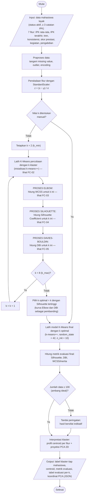
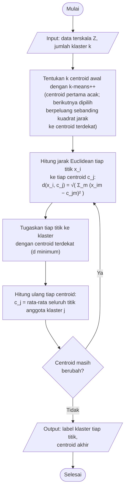
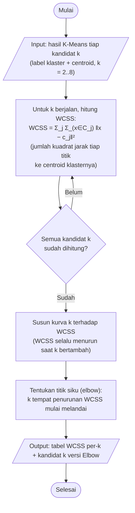
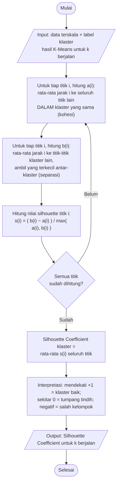
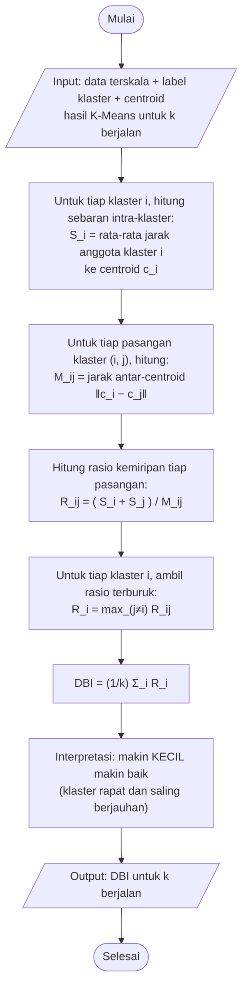

# Flowchart Proses Klasterisasi K-Means — SIMAFTUNSUR (BAB III)

> **Menjawab feedback dosen 2 Juli 2026:** proses klasterisasi digambarkan sebagai
> **flowchart** (bukan Activity Diagram), dengan proses **Elbow**, **Silhouette**,
> dan **Davies-Bouldin Index** yang terpisah dan terlihat tahapannya.
> Diselaraskan dengan implementasi nyata `ml/pipeline/` (orchestrator, train,
> evaluate, interpret) per 2026-07-02.
>
> **Render:** cara termudah — jalankan `tools\render-gambar.ps1`; kelima
> flowchart otomatis jadi PNG latar putih di `docs\gambar\` (FC-01..FC-05)
> lewat sumber PlantUML `docs/vp-import/simaftunsur-flowchart.puml` (java-only).
> Blok ```mermaid``` di bawah tetap disediakan untuk pratinjau cepat di
> <https://mermaid.live> (bila ekspor dari sana, pilih **latar putih**, bukan
> transparan). Untuk Visual Paradigm, gambar ulang memakai palet **Flowchart**
> VP mengikuti sumber teks ini (oval = mulai/selesai, jajar genjang =
> input/output, persegi = proses, belah ketupat = keputusan).

---

## FC-01 — Flowchart Utama Proses Klasterisasi

Loop evaluasi k menghitung **tiga metrik terpisah** untuk tiap kandidat k (2–8):
WCSS (bahan Metode Elbow), Silhouette Coefficient, dan Davies-Bouldin Index.
Pemilihan k memakai Silhouette tertinggi; Elbow dan DBI menjadi pembanding
(rincian tiap metrik: FC-02 s.d. FC-05).



---

## FC-02 — Flowchart Algoritma K-Means (jarak Euclidean)

Tahapan inti algoritma yang dipanggil pada setiap pelatihan (percobaan per-k
maupun final).



---

## FC-03 — Flowchart Proses Metode Elbow (WCSS)



---

## FC-04 — Flowchart Proses Silhouette Coefficient



---

## FC-05 — Flowchart Proses Davies-Bouldin Index



---

## Keterkaitan dengan kode

| Flowchart | Implementasi |
|---|---|
| FC-01 | `ml/pipeline/orchestrator.py` — `jalankan_klasterisasi()` |
| FC-02 | `ml/pipeline/train.py` — `train_kmeans()` (scikit-learn `KMeans`, `init="k-means++"`) |
| FC-03 | `ml/pipeline/train.py` + `evaluate.py` — `inertia_` per-k (tabel `evaluasi_k`) |
| FC-04 | `ml/pipeline/evaluate.py` — `silhouette_score()`; pemilihan k di `pilih_k_optimal()` |
| FC-05 | `ml/pipeline/evaluate.py` — `davies_bouldin_score()` |

Rumus lengkap tiap metode beserta **contoh perhitungan numerik** (manual vs
scikit-learn, hasil identik) ada di `docs/bab2-scikit-learn-integrasi.md`.
