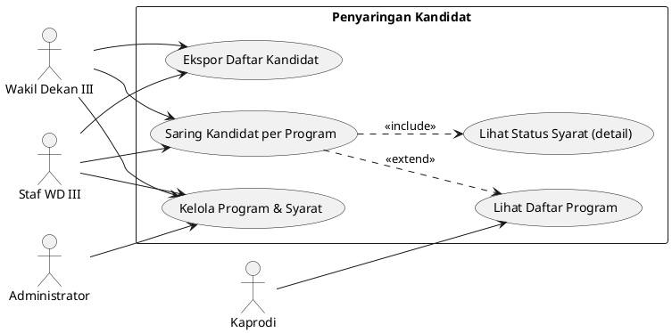
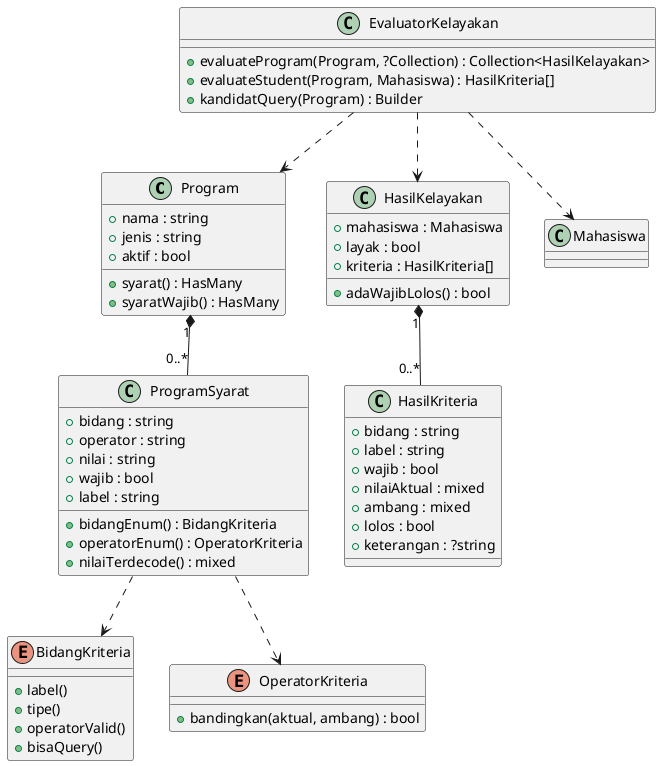
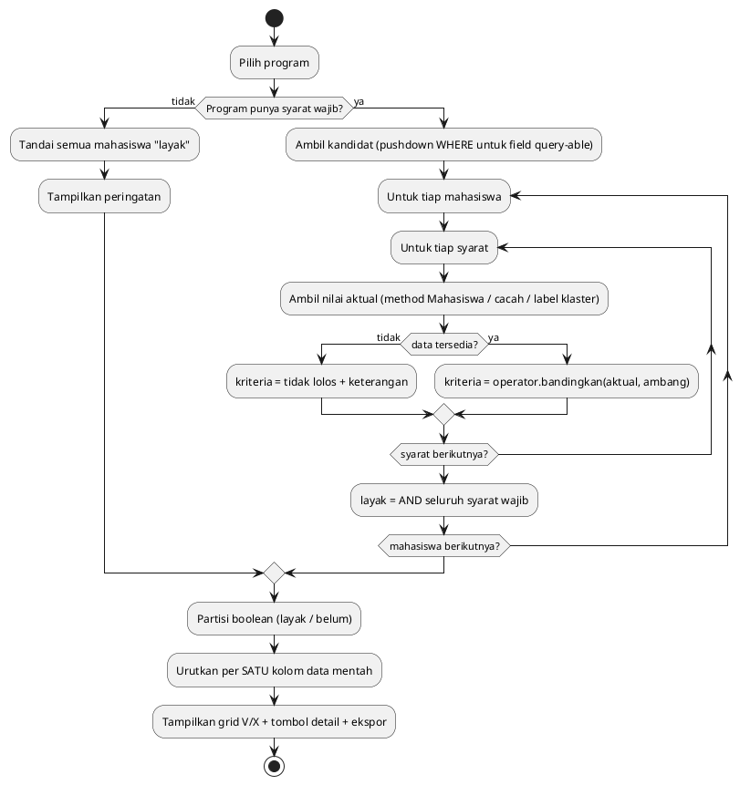

# Modul Penyaringan Kandidat Berbasis Persyaratan Program

> Dokumentasi teknis untuk BAB III–IV. Modul ini adalah **pemanfaatan operasional
> hasil klasterisasi** (bukan fokus penelitian, bukan sistem pendukung keputusan).
> Beasiswa hanyalah salah satu jenis program yang disaring — modul pendukung.

---

## 1. Deskripsi Use Case

**Aktor:**

- **Wakil Dekan III (WD III)** & **Staf WD III** — mendefinisikan program & persyaratan
  (CRUD), membuka halaman penyaringan, mengekspor daftar kandidat.
- **Administrator** — akses penuh (superset).
- **Kaprodi** — hanya melihat daftar program (read-only), tidak menyaring.

**Alur utama (Penyaringan Kandidat):**

1. Pengguna memilih satu program pada halaman Penyaringan Kandidat.
2. Sistem menampilkan ringkasan syarat program (kriteria + badge wajib/opsional).
3. Sistem mengevaluasi tiap mahasiswa terhadap seluruh syarat secara **independen**
   (boolean lolos/tidak), lalu menampilkan yang **memenuhi seluruh syarat wajib**.
4. Kolom ✓/✗ menampilkan status tiap syarat; pengurutan hanya per satu kolom data
   mentah (IPK, poin, dsb).
5. Pengguna dapat mengekspor daftar (CSV) sebagai bahan keputusan manual WD III.

**Alur alternatif:**

- **Program tanpa syarat wajib** → konjungsi atas himpunan kosong bernilai benar,
  sehingga seluruh mahasiswa dianggap memenuhi; UI menampilkan peringatan.
- **Mahasiswa belum diklaster** → kriteria `label_klaster` dinilai *tidak lolos*
  dengan keterangan "belum diklaster" (tidak error, tidak diasumsikan lolos).
- **Mode audit** → toggle "Tampilkan yang belum memenuhi" (**aktif secara bawaan**)
  menampilkan mahasiswa yang memenuhi *minimal satu* syarat wajib (yang 0
  disembunyikan), tetap tanpa peringkat kedekatan. Dapat dimatikan untuk melihat
  hanya yang memenuhi seluruh syarat wajib.

---

## 2. Struktur Tabel

### 2.1 `program`

| Kolom | Tipe | Keterangan |
|---|---|---|
| `id` | bigint PK | |
| `nama` | string | Nama program |
| `jenis` | enum(`beasiswa`,`prestasi_mahasiswa`,`lainnya`) | Jenis program |
| `deskripsi` | text nullable | |
| `penyelenggara` | string nullable | |
| `pendaftaran_mulai` / `pendaftaran_selesai` | date nullable | Periode pendaftaran |
| `kuota` | unsignedInteger nullable | Informatif — tidak memotong daftar otomatis |
| `aktif` | boolean | |
| `dibuat_oleh` | FK `pengguna` nullable | Pembuat |
| `created_at`/`updated_at`/`deleted_at` | timestamp | softDelete |

### 2.2 `program_syarat`

Satu baris = satu kriteria boolean. **Tidak ada kolom bobot/skor.**

| Kolom | Tipe | Keterangan |
|---|---|---|
| `id` | bigint PK | |
| `program_id` | FK `program` cascade | |
| `bidang` | string | Nilai enum `BidangKriteria` (mis. `ipk_rata_rata`) |
| `operator` | string | Nilai enum `OperatorKriteria` (`gte/lte/gt/lt/eq/in`) |
| `nilai` | string | Ambang; JSON untuk `in` & field khusus |
| `wajib` | boolean | Wajib ikut AND kelayakan; tidak wajib = informatif |
| `label` | string | Kalimat syarat Bahasa Indonesia untuk tampilan |

### 2.3 Tabel klasterisasi (dipakai ulang, tidak dibuat baru)

`label_klaster` bersumber dari eksekusi K-Means **terbaru**:
`klasterisasi_eksekusi` (header run) → `klasterisasi_anggota` (mahasiswa↔cluster) →
`klasterisasi_klaster.label_deskriptif`. Riwayat run lama tidak ditimpa.

### 2.4 Daftar `criterion_field` (Enum `BidangKriteria`)

| Kategori | Field | Sumber | Query-able |
|---|---|---|---|
| Akademik | `ipk_rata_rata`, `ipk_terakhir`, `tren`, `konsistensi` | Method Model Mahasiswa | tidak |
| Non-akademik | `skor_prestasi` (F5), `skor_kegiatan` (F6), `skor_pengabdian` (F7) | Rubrik SKKM | tidak |
| Non-akademik | `jumlah_prestasi_min_tingkat` | Cacah prestasi per tingkat | tidak |
| Administratif | `status`, `program_studi`, `angkatan`, `semester_aktif` | Kolom tabel mahasiswa | **ya** |
| Klasterisasi | `label_klaster` | Eksekusi K-Means terbaru | tidak |

---

## 3. Sumber Diagram (PlantUML)

### 3.1 Use Case (delta terhadap diagram existing)



### 3.2 Class Diagram (`EvaluatorKelayakan` + entitas terkait)



### 3.3 Activity Diagram (alur penyaringan)



---

## 4. Justifikasi Metodologis (untuk penguji)

Modul ini adalah **penyaringan kelayakan boolean** (*eligibility filtering*), **bukan**
SAW/WP/TOPSIS/Profile Matching. Tiap kriteria dievaluasi **independen** sebagai
lolos/tidak; kelayakan program adalah **konjungsi (AND) seluruh syarat wajib** —
setara klausa `WHERE` bertumpuk pada basis data. **Tidak ada** pembobotan kriteria,
**tidak ada** skor gabungan/agregasi, **tidak ada** persentase kecocokan, dan
**tidak ada** pemeringkatan berdasarkan tingkat kecocokan. Pengurutan tampilan hanya
per satu kolom data mentah (mis. IPK) sebagai kenyamanan, bukan skor. Keputusan akhir
penetapan kandidat berada pada Wakil Dekan III; sistem hanya menyaring berdasarkan
persyaratan yang didefinisikan. Dengan demikian modul ini tidak memenuhi ciri sistem
pendukung keputusan MCDM maupun sistem pakar (tidak ada bobot, agregasi, maupun
inferensi berantai).

---

## 5. Permission (RBAC) & Pemetaan Peran

Ditambahkan ke daftar izin kanonik `config/peran.php` (mekanisme kustom via
`Pengguna::punyaIzin`, bukan Spatie). Otorisasi model diperkuat `App\Policies\ProgramPolicy`.

| Permission | Administrator | WD III | Staf WD III | Kaprodi | Staf Prodi |
|---|:---:|:---:|:---:|:---:|:---:|
| `program.lihat` | ✅ | ✅ | ✅ | ✅ (read-only) | ❌ |
| `program.kelola` | ✅ | ✅ | ✅ | ❌ | ❌ |
| `program.saring` | ✅ | ✅ | ✅ | ❌ | ❌ |
| `program.ekspor` | ✅ | ✅ | ✅ | ❌ | ❌ |

> Administrator memakai wildcard `*` sehingga otomatis memiliki seluruh izin.

---

## 6. Ringkasan Skenario Pengujian

**Pengujian fungsional (data simulasi — bukan analisis penelitian):**

*Unit `EvaluatorKelayakan` (11 kasus):* batas operator `gte`/`gt` tepat di ambang;
operator `in`; `jumlah_prestasi_min_tingkat` (tingkat ≥ target); mahasiswa belum
diklaster; IPK kosong → "data belum tersedia"; kelayakan = AND syarat wajib; syarat
opsional tidak memengaruhi; program tanpa syarat wajib → semua layak; `kandidatQuery`
mempersempit via WHERE.

*Feature CRUD program (5 kasus):* otorisasi staf_prodi ditolak & wd3 diizinkan;
membuat program + syarat; menolak kombinasi field–operator tidak valid; menyimpan
nilai JSON + label untuk operator `in`.

*Feature halaman penyaringan (5 kasus):* otorisasi; menampilkan hanya yang memenuhi
syarat wajib; audit menampilkan yang belum memenuhi; audit menyembunyikan yang 0
syarat wajib; ekspor CSV ditolak staf_prodi & berhasil untuk wd3.

Total modul: **21 pengujian lulus**. Suite proyek: **128 lulus**.

**Analisis klasterisasi (data riil):** evaluasi klaster (Silhouette/DBI/Elbow +
stabilitas/Kruskal-Wallis) tetap memakai data IPK riil F1–F4; modul penyaringan ini
tidak mengubah metodologi klasterisasi.
```
Program contoh seeder: "Beasiswa Unggulan 2026" (status aktif + IPK≥3,25 + skor
kegiatan≥40) & "Pilmapres FT 2026" (IPK terakhir≥3,50 + ≥1 prestasi nasional +
label klaster "Berprestasi" opsional).
```
