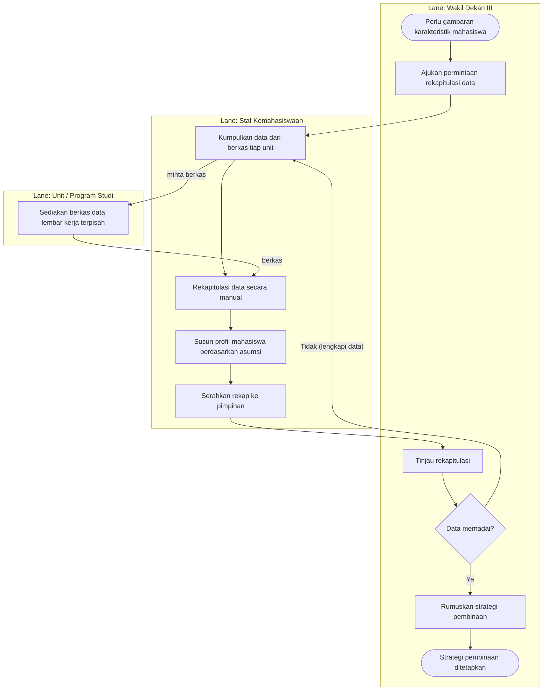

# Proses Bisnis yang Sedang Berjalan (Sistem Manual)

Diagram proses **pengelolaan data kemahasiswaan yang berjalan saat ini** (manual & tersebar),
untuk BAB III — Analisis Sistem yang Sedang Berjalan. Menyoroti titik nyeri: rekapitulasi manual,
profiling berbasis asumsi, dan adanya perulangan permintaan data (rework).

## Cara membuat diagram TANPA Visual Paradigm (gratis)

Tersedia tiga bentuk sumber — pakai yang paling mudah bagimu:

1. **PlantUML (disarankan)** — `proses-berjalan.puml`. Activity Diagram swimlane, notasi UML baku,
   umum dipakai skripsi SI/TI di Indonesia. Render gratis:
   - **planttext.com** — tempel isi `.puml`, klik *Refresh*, lalu *Download* PNG/SVG.
   - **plantuml.com/plantuml** — server resmi PlantUML.
   - **VS Code** + ekstensi *PlantUML* (Alt+D untuk pratinjau, lalu ekspor).
2. **BPMN 2.0** — `proses-berjalan.bpmn`. Bisa diimpor ke **draw.io / diagrams.net** (gratis, GUI):
   *Extras → Edit Diagram* atau *File → Import*; draw.io juga punya bentuk BPMN/Flowmap bawaan bila
   ingin menggambar ulang secara manual.
3. **Mermaid** — blok di bawah, untuk verifikasi alur cepat (render di editor Markdown/GitHub).

> **Ekspor latar PUTIH**, hindari PNG transparan (sesuai catatan pembimbing).
> Alternatif GUI penuh pengganti VP: **draw.io (diagrams.net)** — gratis, punya stensil UML, BPMN,
> dan Flowmap; cocok bila ingin menata diagram secara manual.

## Alur (referensi visual — Mermaid)

## Elemen (untuk penomoran/keterangan di naskah)

| Lane | Kegiatan |
|---|---|
| Wakil Dekan III | Mengajukan permintaan rekapitulasi; meninjau hasil; memutuskan kecukupan data; merumuskan strategi pembinaan. |
| Staf Kemahasiswaan | Mengumpulkan data dari berkas tiap unit; merekapitulasi manual; menyusun profil berdasarkan asumsi; menyerahkan ke pimpinan. |
| Unit / Program Studi | Menyediakan berkas data (lembar kerja terpisah). |

**Titik nyeri yang ditonjolkan:** proses manual & memakan waktu, profiling berbasis asumsi (bukan analisis
data), serta gerbang keputusan "Data memadai?" yang kerap memicu perulangan permintaan data. Ketiga hal ini
menjadi dasar kebutuhan sistem yang diusulkan (SIMAFTUNSUR) pada subbab berikutnya.
